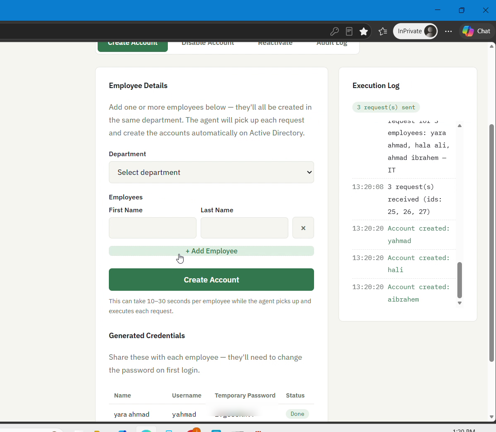
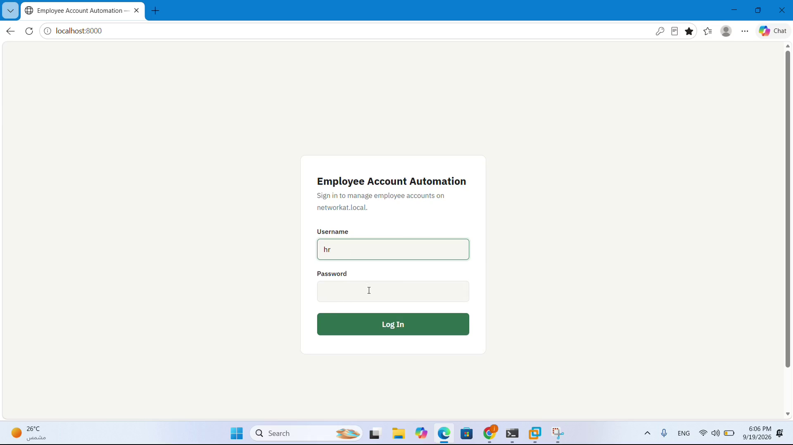
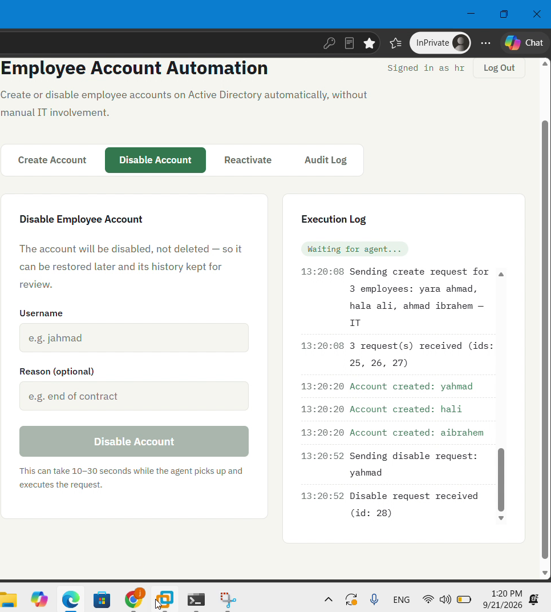
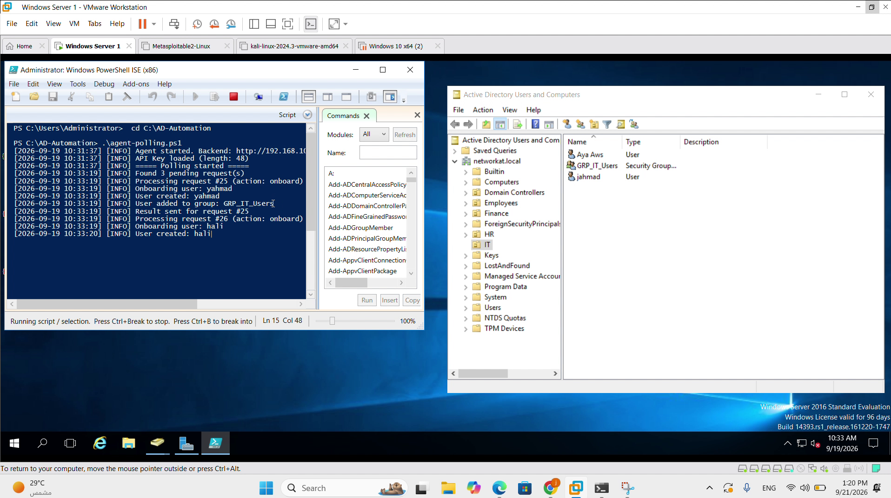
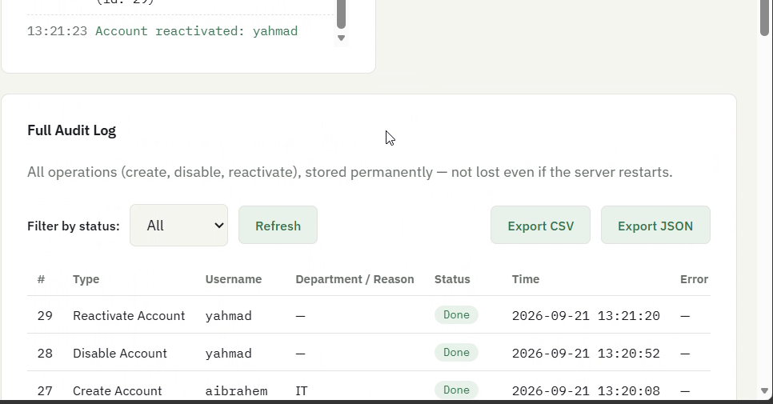

# AD Onboarding & Offboarding Automation

A self-service tool that lets HR create, disable, and reactivate employee accounts on
Active Directory automatically — no manual IT intervention required.

Built as a personal project to automate a repetitive task I kept running into during
hands-on Active Directory administration: every new hire or leaver means a sysadmin has
to manually create/disable an AD account, assign the right OU and security groups, and
remember to do it consistently. This tool removes that manual step entirely.

**[▶ Watch the demo video](docs/demo.mp4)** (2 min)



## How it works

```
 HR (web browser)                Backend (FastAPI)              Agent (on the AD server)
 ─────────────────                ─────────────────              ────────────────────────
 Logs in, submits a    ────POST──▶  Stores the request    ◀──poll── Asks every few seconds:
 create/disable/                    in SQLite (audit.db)            "any pending requests?"
 reactivate request                 status = "pending"
                                                             ──────▶ Executes on Active
                                                                     Directory:
                                                                     New-ADUser /
                                                                     Disable-ADAccount /
                                                                     Enable-ADAccount
                                                             ◀──POST── Reports the result
                                     Updates status to
                                     "done" or "failed"
 Sees the result       ◀───poll───
 in the activity log
```

The agent only ever reaches *out* to the backend — no inbound port is opened on the
company network, so it works from behind a normal firewall without any special
configuration.

## Features

- **Create accounts in bulk** — enter several employees at once (e.g. three new hires
  in IT), pick one department, and they're all queued together. Usernames follow a
  naming convention (first initial + last name, with automatic de-duplication) and each
  employee gets their own random temporary password, shown in a credentials table
  with live per-employee status.
- **Disable / Reactivate** accounts, with a confirmation step before either action
  (disabled — never deleted — so the account and its history can be restored)
- **Persistent audit log** (SQLite) — every action is recorded permanently and survives
  server restarts, filterable by status, with CSV/JSON export
- **Authentication**
  - HR users log in with a username/password (JWT-based sessions)
  - The Agent authenticates separately with its own API key, so a leaked HR
    password can never be used to impersonate the Agent
- **No secrets in source control** — the JWT signing key and the database are
  generated locally and excluded via `.gitignore`

## Screenshots

| | |
|---|---|
|  |  |
|  |  |

The bottom-left shot is the PowerShell agent running next to *Active Directory Users
and Computers* — the accounts requested from the web UI really do appear in AD.

## Tech stack

| Layer      | Choice                                    |
|------------|--------------------------------------------|
| Agent      | PowerShell (`Invoke-RestMethod`, ActiveDirectory module) |
| Backend    | Python, FastAPI, SQLite                   |
| Frontend   | Vanilla HTML/CSS/JS (no build step)        |
| Auth       | JWT (HS256, hand-rolled with the Python standard library — no external dependency) + PBKDF2 password hashing |

## Project structure

```
.
├── backend/
│   ├── backend.py         # FastAPI app — all API endpoints
│   ├── create_user.py     # CLI script to create/update an HR login
│   ├── requirements.txt
│   └── static/
│       └── index.html     # The web interface (served by the backend)
├── agent/
│   ├── agent-polling.ps1      # PowerShell polling agent (runs near the DC)
│   ├── config.example.json    # copy to config.json and fill in
│   └── README.md
├── docs/
│   ├── demo.mp4           # Screen recording of the full flow
│   └── screenshots/
└── LICENSE
```

## Setup

### 1. Backend

```bash
cd backend
python -m venv venv
source venv/bin/activate        # Windows: venv\Scripts\activate
pip install -r requirements.txt

# Create your HR login (run once)
python create_user.py

# Start the server
uvicorn backend:app --host 0.0.0.0 --port 8000
```

Open `http://localhost:8000` and log in with the account you just created.

### 2. Register the Agent

While the backend is running, register an agent to get its API key:

```bash
curl -X POST http://localhost:8000/api/agents/register \
  -H "Content-Type: application/json" \
  -H "Authorization: Bearer <your JWT token from logging in>" \
  -d '{"name": "primary-dc-agent"}'
```

This returns an `api_key` — put it in the agent's `config.json`. It's shown
**once only**; if you lose it, generate a new one with
`POST /api/agents/{id}/regenerate-key`.

### 3. Agent

Runs on (or with network access to) your Domain Controller, polling the backend
and executing the AD changes. See `agent/README.md`.

## Try it without an Active Directory (demo mode)

Want to let someone click through the app without giving them access to a real
domain? Start the backend with `DEMO_MODE=1`:

```bash
DEMO_MODE=1 uvicorn backend:app --host 0.0.0.0 --port 8000
```

In demo mode a background thread plays the role of the agent: it picks up pending
requests and completes them after a few seconds, so the whole flow (create, disable,
reactivate, audit log) works end-to-end — but **nothing touches a real Active
Directory**. A login is seeded automatically: `demo` / `demo1234`.

This is also the safe way to host a public demo (e.g. on Render or Railway):

- Root directory: `backend`
- Build command: `pip install -r requirements.txt`
- Start command: `uvicorn backend:app --host 0.0.0.0 --port $PORT`
- Environment variable: `DEMO_MODE=1`

Free tiers use an ephemeral filesystem, so demo data resets on restart — which is
exactly what you want for a public sandbox.

> Never point a public deployment at a real Domain Controller.

## Security notes

- Change `allow_origins=["*"]` in `backend.py`'s CORS config to your actual domain
  before exposing this beyond your local network.
- `audit.db` and `secret.key` are excluded from git on purpose — they contain
  request history and the token-signing secret. Never commit them.
- The Agent's AD service account should have the minimum delegated permissions
  needed (create/disable/enable users in the target OU) — not Domain Admin.

## License

MIT — see [LICENSE](LICENSE).
